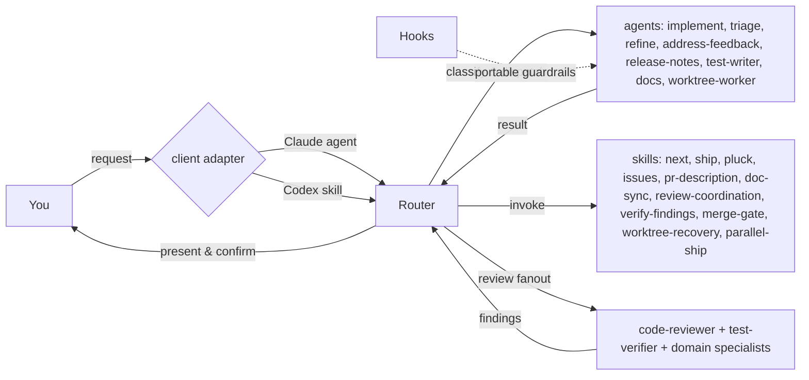
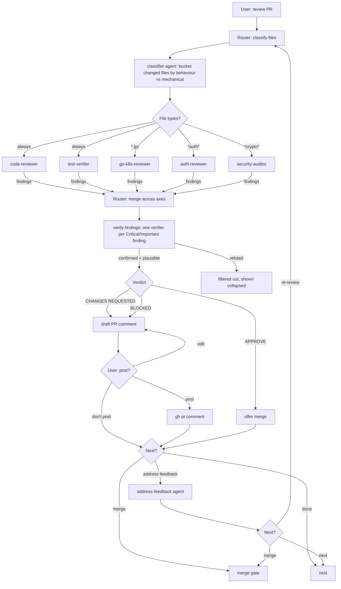
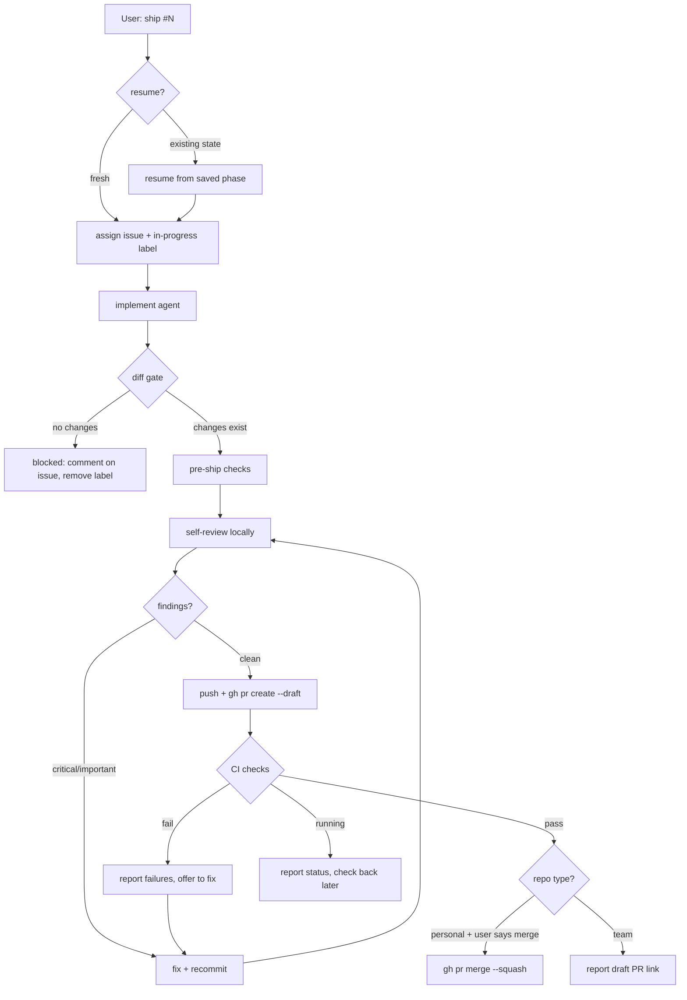
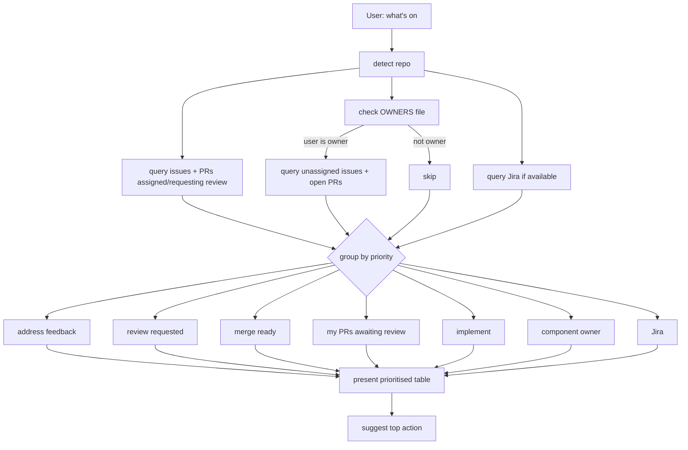

# clawdio

Portable Claude Code and Codex plugin for SDLC automation. A router dispatches specialist prompts based on the task, skills provide cross-cutting workflow knowledge, and hooks enforce guardrails.

The premise: the bottleneck is never orchestration infrastructure -- it's agent reliability. Clawdio keeps one canonical set of agents and workflows, with thin adapters for each client, rather than maintaining parallel Claude and Codex implementations.

## Install

### Codex

```bash
codex plugin marketplace add jasonmadigan/clawdio
codex plugin add clawdio@jasonmadigan-clawdio
```

Start a new conversation and ask Codex to use `clawdio:router`, or describe the SDLC task and name clawdio. Codex loads the router skill, which reads the same canonical router and specialist prompts used by Claude Code.

To update a marketplace added with the GitHub repository name above, refresh its cached Git snapshot:

```bash
codex plugin marketplace upgrade jasonmadigan-clawdio
```

The installed `clawdio@jasonmadigan-clawdio` plugin follows that snapshot, so it does not need to be removed or added again. Start a new Codex conversation after upgrading. To refresh every configured Git marketplace instead, omit the marketplace name. Marketplaces added from a filesystem path are local; update those through the checkout as described below.

### Claude Code

```bash
claude plugin marketplace add addyosmani/agent-skills
claude plugin marketplace add kuadrant/dev-team-plugin
claude plugin marketplace add jasonmadigan/clawdio
claude plugin install clawdio
```

Start with the router agent, or select it with `--agent clawdio:router`.

### Local development

```bash
# Claude Code
claude --plugin-dir /path/to/clawdio
claude --plugin-dir /path/to/clawdio --agent clawdio:router

# Codex: add the checkout as a local marketplace, then install from it
codex plugin marketplace add /path/to/clawdio
codex plugin add clawdio@jasonmadigan-clawdio
```

A local marketplace reads the plugin directly from the checkout. Pull changes there instead of running `codex plugin marketplace upgrade`, which only accepts Git marketplace snapshots:

```bash
git -C /path/to/clawdio pull --ff-only
```

Start a new Codex conversation after updating the checkout.

Claude Code can reload changes in an active session:

```
/reload-plugins
```

## Dependencies

Only `gh` is required for GitHub workflows themselves. Clawdio also requests capabilities supplied by other skill packages.

### External capability providers

| Capability | Claude Code installation | Portable behaviour when absent |
|-|-|-|
| [agent-skills](https://github.com/addyosmani/agent-skills) | `claude plugin marketplace add addyosmani/agent-skills && claude plugin install agent-skills` | Use an installed equivalent skill, then fall back to the baseline procedure in the canonical specialist prompt |
| [dev-team-plugin](https://github.com/kuadrant/dev-team-plugin) (`kdt`) | `claude plugin marketplace add kuadrant/dev-team-plugin && claude plugin install kdt` | Compose clawdio's local refine, docs, implement, review, and next workflows |
| Browser automation | `claude plugin install playwright` | Use an available browser-testing skill or MCP server; otherwise report that UI verification was unavailable |

The Claude manifest declares `agent-skills` and `kdt` as package dependencies. Codex has no portable way to assume those Claude packages are present, so the central resolver in [`references/dispatch-rules.md`](references/dispatch-rules.md) treats each external name as a capability request: prefer the named skill, then an installed equivalent, then a documented local fallback. Clawdio does not copy third-party skill bodies into this repository.

### CLI tools

| Tool | Purpose | Used by |
|-|-|-|
| [`gh`](https://cli.github.com/) | GitHub issue/PR operations | implement, review, triage, refine, address-feedback, next, ship, worktree-worker, issues |
| Python 3.9+ | Portable hook payload parsing | lifecycle hooks |

GitHub CLI must be authenticated (`gh auth login`).

### MCP servers

| Server | Purpose | Used by |
|-|-|-|
| GitHub MCP | Issue/PR comments, review threads | address-feedback |
| [Atlassian MCP](https://github.com/sooperset/mcp-atlassian) | Jira issue search, creation, updates | next, triage, router |

Install Atlassian MCP with either client (requires `uv`):

```bash
# Claude Code
claude mcp add atlassian -s user \
  -e JIRA_URL=https://your-site.atlassian.net \
  -e JIRA_USERNAME=you@company.com \
  -e JIRA_API_TOKEN=your-token \
  -- uvx mcp-atlassian --jira-url https://your-site.atlassian.net

# Codex
codex mcp add atlassian \
  --env JIRA_URL=https://your-site.atlassian.net \
  --env JIRA_USERNAME=you@company.com \
  --env JIRA_API_TOKEN=your-token \
  -- uvx mcp-atlassian --jira-url https://your-site.atlassian.net
```

## How it works

Talk to the **router**. Claude Code exposes it as a native plugin agent; Codex exposes a thin router skill that loads the canonical `agents/router.md`. Both use the same specialist files and workflows.



### Review flow

The router owns review fanout on both clients. Specialists never dispatch other specialists, which keeps the execution model predictable and the canonical prompts portable.



### Ship flow

Full lifecycle from issue to merged PR. Supports `--resume` (pick up mid-flow), `--skip-review`, and `--draft`.



For multiple issues ("ship #1, #2, #3"), the router dispatches worktree-worker agents in isolated git worktrees when the active client provides or can verify that isolation; otherwise it runs write-heavy work serially.

### What's on flow

Scoped to the current repo by default. Checks OWNERS files for component ownership.



### Typical commands

**"Pluck"** -- invokes the `pluck` skill. Shows unassigned issues in the current repo. Pick ones to claim without starting implementation.

**"What's on?"** -- invokes the `next` skill. Queries GitHub for issues, PRs, and feedback in the current repo, ranked by the project board (or a saved team view of it) when one exists. Returns a prioritised table.

**"Ship #42"** -- invokes the `ship` skill. Implements, pushes, creates PR, self-reviews, fixes findings, reports back.

**"Review this PR"** -- classifies files, dispatches specialist reviewers in parallel, collects findings, drafts PR comment.

**"Triage this issue"** -- dispatches the triage agent. Assesses readiness, recommends workflow (implement, refine, split, or human review).

**"This issue is vague"** -- dispatches the refine agent. Produces a structured spec with testable acceptance criteria.

**"Ship #1, #2, #3"** -- dispatches worktree-worker agents in parallel, each in its own worktree. Collects results and presents a summary table.

**"Create an issue"** -- invokes the `issues` skill. Creates issues with acceptance criteria, manages state, links PRs.

## Agents

These Markdown files are the canonical specialist prompts. Claude Code discovers them as plugin agents; the Codex router passes their paths to built-in subagents instead of maintaining duplicate TOML definitions.

| Agent | Purpose |
|-|-|
| router | Task intake, classification, delegation. Coordinates review fanout. Never writes code. |
| implement | Takes a well-defined issue, writes code, runs tests, commits |
| code-reviewer | General code quality: correctness, readability, architecture, naming |
| security-auditor | Security review: injection, auth bypasses, secrets, crypto, OWASP |
| go-k8s-reviewer | Go idioms, concurrency, controller patterns, CRD conventions, RBAC |
| auth-reviewer | OAuth2/OIDC flows, token handling, policy evaluation, standards compliance |
| triage | Assesses issue readiness, labels, prioritises, recommends workflow |
| refine | Turns vague issues into implementable specs with acceptance criteria |
| address-feedback | Reads PR review comments, categorises, fixes, reports what needs human input |
| release-notes | Generates grouped release notes between git tags |
| test-writer | Finds coverage gaps, writes targeted tests matching project patterns |
| test-verifier | Verifies PR test plans: runs tests, checks criteria, drives browser for UI checks |
| verifier | Adversarial verifier for exactly one finding: refutes or confirms with evidence |
| docs | Writes and updates documentation. Verifies every example and path. |
| worktree-worker | Self-contained implement-to-PR in an isolated worktree. For parallel multi-issue dispatch. |

## Skills

Clawdio provides its own skills for SDLC orchestration. Optional providers such as [agent-skills](https://github.com/addyosmani/agent-skills) and [dev-team-plugin](https://github.com/kuadrant/dev-team-plugin) can add deeper development or feature-lifecycle guidance.

### Clawdio skills

| Skill | Trigger | Args | Purpose |
|-|-|-|-|
| router | "use clawdio", "clawdio router" | conversation context | Codex entry adapter that loads the canonical router and dispatch rules; Claude Code normally enters through the native router agent |
| next | "what's on?", "what next?", "next project issues?" | none | Scans GitHub and Jira for issues, PRs, and feedback across repos, ranked by project boards or saved team views where present |
| ship | "ship #42" | `<issue>`, `--resume`, `--skip-review`, `--ready` | Full lifecycle: implement > push > draft PR > self-review > fix |
| pluck | "pluck", "claim issue", "grab issue" | none | Claim unassigned issues from the repo backlog without implementing |
| pr-description | Creating a PR | none | PR body template: summary, linked issue, test evidence |
| issues | "create issue", "update issue" | `create`, `update`, `close`, `link`, `--repo` | Create, update, close issues. Manages PR-issue links and lifecycle state. |
| doc-sync | "check docs", "are docs up to date" | none | Verify and fix documentation accuracy against actual repo contents |
| review-coordination | PR review dispatch | none | Coordinates multi-specialist PR review fanout |
| verify-findings | "verify", "double-check", after findings return | none | Adversarial verification of Critical/Important findings before presenting or posting |
| merge-gate | pre-merge checks | none | Pre-merge safety checks before any merge |
| worktree-recovery | worktree recovery | none | Recovers in-progress worktree workers before dispatching new ones |
| parallel-ship | "ship #1, #2, #3" | `<issues>` | Dispatches multiple worktree-workers in parallel for multi-issue ship |

### agent-skills (external provider)

Clawdio agents request [agent-skills](https://github.com/addyosmani/agent-skills) capabilities at key workflow points. When those exact skills are not installed, the portability resolver uses an equivalent installed skill or the baseline process already present in the agent prompt.

| agent-skills skill | Used by | When |
|-|-|-|
| code-review-and-quality | code-reviewer, go-k8s-reviewer | Five-axis review (correctness, readability, architecture, security, performance) |
| code-simplification | code-reviewer | Identify simplification opportunities in reviewed code |
| security-and-hardening | security-auditor, auth-reviewer | OWASP, secrets, auth/authz checks |
| test-driven-development | implement, worktree-worker, test-verifier, test-writer | RED-GREEN-REFACTOR loop |
| incremental-implementation | implement, worktree-worker, address-feedback | One logical change per commit, vertical slices |
| debugging-and-error-recovery | implement, worktree-worker, address-feedback | When tests fail and cause is unclear |
| spec-driven-development | implement, refine | Spec-first for non-trivial changes |
| planning-and-task-breakdown | refine, triage | Break scope into ordered tasks |
| api-and-interface-design | go-k8s-reviewer, auth-reviewer | API surface stability, Hyrum's Law checks |
| performance-optimization | go-k8s-reviewer | N+1 queries, unbounded ops, async patterns |
| git-workflow-and-versioning | ship, worktree-worker, address-feedback | Commit conventions, branch hygiene |
| shipping-and-launch | ship | Pre-ship checklist in phase 2 |
| documentation-and-adrs | docs | ADR structure and documentation patterns |
| browser-testing-with-devtools | test-verifier | Drive browser for UI verification |

### kdt (external provider)

The router prefers [dev-team-plugin](https://github.com/kuadrant/dev-team-plugin) skills for design and feature lifecycle work. Local compositions cover the same routing intent when kdt is unavailable; clawdio does not vendor kdt's instructions.

| kdt skill | Trigger | Purpose |
|-|-|-|
| feature-design | "design doc", "feature design" | Create and review design docs, generate issues from TODOs |
| feature-implement | "pick up", "implement from design" | Pick up issues from design docs, manage feature lifecycle |
| pr-closes-issue | "does the PR close the issue" | Verify PR changes match issue requirements |
| external-contribs | "external contribs", "community PRs" | Find external contributions needing attention |

## Hooks

| Hook | Trigger | Purpose |
|-|-|-|
| block-env-writes | Before Write/Edit or apply_patch | Blocks writes to `.env`, credentials, `.pem`, `.key` files |
| doc-sync-reminder | After Write/Edit or apply_patch | Reminds to update docs and both manifests when plugin definitions change |
| format-on-save | After Write/Edit or apply_patch | Runs project formatter if configured (prettier, gofmt, clang-format) |
| lint-on-edit | After Write/Edit or apply_patch | Runs project linter if configured (eslint, golangci-lint) |

`hooks/file_hook.py` normalises Claude Code's file-path input and Codex's `apply_patch` payload. Hook policy and formatter/linter logic therefore live in one implementation.

## Structure

```
agents/           subagent definitions (one .md per agent)
skills/           on-demand skills (SKILL.md per directory)
hooks/            shared lifecycle config and portable hook implementation
references/       supporting docs agents can read (includes dispatch-rules.md)
docs/             architecture decisions and project context
.claude-plugin/   Claude Code manifest and shared marketplace config
.codex-plugin/    Codex manifest
AGENTS.md         Codex repository instructions
CLAUDE.md         Claude Code repository instructions
```

## Personalisation

The go-k8s-reviewer and auth-reviewer ship with generic definitions suitable for any Go/K8s or auth project. Claude Code users can override them in `~/.claude/agents/`; Codex users can add repository-specific context in `AGENTS.md` or install an equivalent specialist skill.

Personal and proprietary prompt extensions stay out of this repo.

## Development

See [docs/contributing.md](docs/contributing.md) for how to write agents, skills, and hooks.

Keep both manifests at the same version. Validate with both clients before publishing; the exact commands are in the contributor guide.

## Design

See [docs/architecture.md](docs/architecture.md) for the full design rationale, including why this is a plugin rather than an orchestrator and how the shared prompt/adaptor boundary works.

See [docs/grill-findings.md](docs/grill-findings.md) for the structured interview that informed these decisions.
