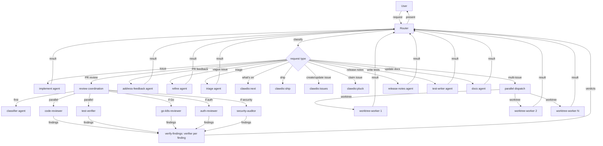
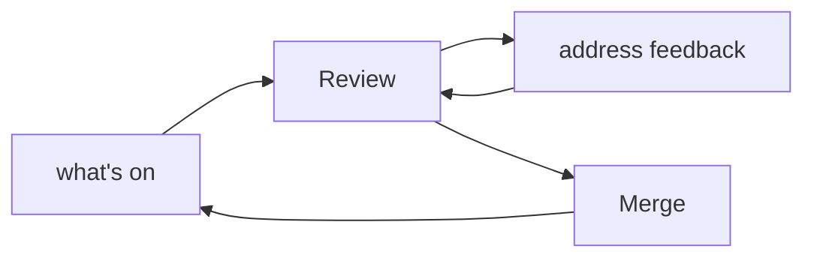

# Architecture

## Origin

This plugin replaces clawdio, a custom Go orchestrator for managing AI agent sessions. After a structured interview (April 2025), the conclusion was: the orchestrator was over-built. The bottleneck was never orchestration infrastructure -- it was agent reliability. The investment should go into building good agents, skills, and hooks that work natively in Claude Code.

## Design decisions

### Why a plugin, not an orchestrator

Clawdio provided: work item database, GitHub polling, worktree management, tmux session lifecycle, skill-based prompt construction, workflow chaining (implement > review > merge), and a TUI for monitoring agents.

Most of this is now covered by Claude Code natively:
- Git worktrees: EnterWorktree/ExitWorktree tools
- GitHub operations: `gh` CLI or GitHub MCP server
- Skills: `.claude/skills/*.md`, loaded on demand
- Subagents: `.claude/agents/*.md`, isolated context windows
- Hooks: pre/post tool use, deterministic shell commands
- Session resume: `--resume` flag

What clawdio added on top was multi-agent spawning, monitoring, and workflow chaining. But the user works serially in practice, and the fanout pattern (router agent dispatching specialists) handles workflow chaining in natural language rather than hardcoded YAML transitions.

### Router + specialist pattern

A single router agent (router.md) serves as the entry point for all tasks. It classifies the request, dispatches specialists, collects results, and reports back. This replaces clawdio's workflow engine.

### Multi-pass review

Reviews use the fanout pattern: the router invokes the `review-coordination` skill, which classifies the PR's file paths and determines which specialist reviewers to spawn. A read-only classifier agent buckets each changed file (behaviour, types-mechanical, mixed, tests-docs) before dispatch -- the router never reads the diff -- so specialists weight attention to behaviour and mixed files and the verdict leads with a focus table. The router then dispatches the specialists in parallel and collects results grouped by specialist.

Specialist findings are treated as claims, not facts. Before findings are presented or posted, the router invokes the `verify-findings` skill: one verifier agent per Critical/Important finding, in parallel, tasked with refuting it. Confirmed and plausible findings proceed; refuted findings are shown collapsed with their refutations and recorded in prior-review context so they do not resurrect on re-review rounds.

The router owns the agent dispatch because subagents cannot spawn sub-subagents (they don't have access to the Agent tool). The review-coordination and verify-findings skills provide the classification, merge, and verification logic; the router executes them.

### SDLC loop

The review flow feeds into address-feedback, which feeds back into review. The router manages this loop.

### Diff gate

After the implement agent completes, ship verifies the agent actually produced code changes by checking `git rev-list` and `git status`. If both are empty, the workflow stops with `blocked` status rather than proceeding to push an empty branch.

This is inline in the ship skill, not a universal hook. A PostToolUse hook can't distinguish implementation agents from other agent calls (it only sees the tool name, not the task semantics). The archived Go engine had typed skill contracts with a `phase` field to scope this; the hook system has no equivalent.

### Workflow state

Multi-phase skills persist their progress to memory files (`memory/workflow_<skill>_<branch>.md`) after each phase gate. If a session dies mid-flow, the next invocation detects the state file and offers to resume.

This replaces the archived engine's `WorkflowRun` database table and `.clawdio-progress.md` file. The memory system is simpler (plain markdown files with frontmatter) and already survives context compression. State files are cleaned up on workflow completion.

### Subagents vs agent teams

Claude Code has two multi-agent models. This plugin uses subagents exclusively.

**Subagents** (what we use): fire-and-forget. Prompt in, result out. The caller blocks or collects results later. No inter-agent communication. Agent tool WITHOUT `name`.

**Agent teams** (experimental, `CLAUDE_CODE_EXPERIMENTAL_AGENT_TEAMS`): persistent collaborators with shared task lists and bidirectional messaging via SendMessage. Agents talk to each other, claim tasks, challenge findings. Agent tool WITH `name`.

The `name` parameter on the Agent tool is what switches between the two models. Passing `name` spawns a teammate that sits idle in mailbox mode waiting for task assignments. Omitting `name` spawns a subagent that executes its prompt immediately.

| | Subagents | Agent teams |
|-|-|-|
| Trigger | Agent tool without `name` | Agent tool with `name` |
| Execution | Prompt executes immediately, result returns | Spawns idle, waits for SendMessage/task claims |
| Communication | Result returns to caller only | Bidirectional via SendMessage, shared task list |
| Best for | Focused tasks where only the result matters | Tasks requiring discussion and cross-agent coordination |
| Maturity | Stable | Experimental -- no session resume, task status lag, one team per session |

**Why subagents fit our dispatch patterns:** all our workflows are router-sends-task, specialist-does-it, result-comes-back. Review fanout dispatches code-reviewer and test-verifier in parallel, but they don't need to share findings mid-flight -- the router merges results after both complete. Worktree-workers are isolated by design. No agent needs to talk to another agent.

**When agent teams would add value** (not currently implemented): competing-hypothesis debugging where agents challenge each other's theories; cross-layer coordination where frontend/backend/test agents share discoveries mid-flight; research tasks that build on each other's findings.

**Decision:** don't build workflows around agent teams until the feature stabilises. Revisit when session resumption and task status reliability are resolved.

### Agent dispatch rule

All agent dispatch in this plugin MUST use `subagent_type` (e.g. `subagent_type: "clawdio:implement"`) WITHOUT `name`. Track agents by the `agentId` returned in the spawn response. This applies to the router, review-coordination, parallel-ship, and ship.

Discovered June 2025 via controlled experiment: 8 named agents produced zero output; 1 unnamed agent completed instantly.

### Worktree isolation

Agents that do implementation work can be dispatched with `isolation: "worktree"` on the Agent tool. Claude Code creates a separate git worktree per agent, the agent works entirely within it, and the worktree is preserved if changes were made (cleaned up if not).

This enables parallel multi-issue work: the router dispatches N worktree-worker agents simultaneously, each in its own worktree, each implementing a different issue. They can't conflict because they're in separate worktrees. When they finish, the router collects structured results (PR URLs, branch names, or blocked status) and presents a summary.

The worktree-worker agent is deliberately constrained: no Agent tool access (can't spawn sub-subagents), no ability to escape its worktree, and a structured output format the router can parse. This makes it a predictable, parallelisable unit of work.

Each worktree-worker writes a `.clawdio-state` file in the worktree root after every phase transition. This file is never git-committed — it's orchestrator-internal. The router checks for these files before dispatching new workers, enabling recovery of workers that died mid-run. The state file records the current phase, issue reference, branch, PR URL, and timestamps.

### Three-tier primitive location

1. **Per-repo** (`.claude/` in each project): CLAUDE.md, repo-specific agents and hooks
2. **Personal plugin** (this repo, installed to `~/.claude/plugins/`): cross-cutting SDLC agents, shared skills, workflow preferences
3. **Org-level** (future): shared plugin for team use

### Vertex auth

All work uses Google Vertex AI for Claude access (work account). No direct Anthropic API access currently. This doesn't constrain the architecture -- Claude Code, GitHub Actions (claude-code-action), and the Agent SDK all support Vertex via environment variables.

### Future: Agent SDK

Start with Claude Code (interactive). When the ceiling is hit (need scheduling, GHA integration, custom UIs, Backstage plugin), port the agents to the Agent SDK. The skills and agent definitions translate directly.

## Success metric

"I open Claude, say 'what's on?', it shows my priorities, I tell it to go."

## User profile

- Senior software engineer
- Works across 3-5 repos in a typical week
- Mix of feature implementation, PR review, and bug investigation
- Deliberate process: read > refine > plan > code > self-review > PR > team review > feedback > merge
- Uses AI assistance across multiple steps, not just for coding
- Team is actively adopting AI workflows
- For personal repos: full autonomy, autopilot acceptable
- For team repos: agents assist, but human stays in the loop

## Agent catalogue

| Agent | Purpose | Scope |
|-|-|-|
| router | Task intake, classification, delegation, review coordination | Plugin |
| implement | Takes a well-defined issue, writes code, runs tests, commits | Plugin |
| code-reviewer | General code quality review | Plugin |
| security-auditor | Security-focused review (OWASP, injection, secrets) | Plugin |
| go-k8s-reviewer | Go/Kubernetes specialist reviewer (generic; override in ~/.claude/agents/) | Plugin |
| auth-reviewer | Auth/policy specialist reviewer (generic; override in ~/.claude/agents/) | Plugin |
| triage | Assesses new issues, labels, prioritises, checks readiness | Plugin |
| refine | Takes vague issues, asks clarifying questions, produces acceptance criteria | Plugin |
| address-feedback | Takes review comments on a PR, fixes them | Plugin |
| release-notes | Generates release notes between tags | Plugin |
| test-writer | Writes tests, finds coverage gaps | Plugin |
| test-verifier | Verifies PR test plans, runs tests, drives browser for UI checks | Plugin |
| verifier | Adversarial verifier for exactly one finding; refutes or confirms with evidence | Plugin |
| docs | Documentation writing and updating | Plugin |
| worktree-worker | Self-contained implement-to-PR in an isolated worktree, for parallel dispatch | Plugin |

Note: subagents cannot spawn sub-subagents (no access to the Agent tool). The router owns all agent dispatch, including review fanout to specialist reviewers in parallel and worktree-worker dispatch for multi-issue shipping.

## Skill catalogue

| Skill | Purpose | Args |
|-|-|-|
| next | Scans GitHub for actionable work, suggests priorities | none |
| ship | Full lifecycle: implement > push > draft PR > review > merge | `<issue>`, `--resume`, `--skip-review`, `--ready` |
| pr-description | PR body template and conventions | none |
| issues | Create, update, link, and manage GitHub issues and PR relationships | `create`, `update`, `close`, `link`, `--repo` |
| pluck | Claim unassigned issues from the repo backlog | none |
| doc-sync | Verify and fix documentation accuracy against actual repo contents | none |
| review-coordination | Coordinates multi-specialist PR review fanout | none |
| verify-findings | Adversarial verification of Critical/Important findings before presenting or posting | none |
| merge-gate | Pre-merge safety checks before any merge | none |
| worktree-recovery | Recovers in-progress worktree workers before dispatching new ones | none |
| parallel-ship | Dispatches multiple worktree-workers in parallel for multi-issue ship | `<issues>` |

Skills for commit conventions, security checklists, and review rubrics are provided by the companion plugin [agent-skills](https://github.com/addyosmani/agent-skills) (`git-workflow-and-versioning`, `security-and-hardening`, `code-review-and-quality`).

## Hook catalogue

| Hook | Trigger | Purpose |
|-|-|-|
| block-env-writes | PreToolUse (Write/Edit) | Prevent writing to .env, credentials files |
| doc-sync-reminder | PostToolUse (Write/Edit) | Remind to update docs when agent/skill/hook files change |
| format-on-save | PostToolUse (Write/Edit) | Auto-format code after edits |
| lint-on-edit | PostToolUse (Write/Edit) | Run linter after every file edit |

## MCP servers

| Server | Purpose |
|-|-|
| GitHub MCP | Issues, PRs, Actions, releases, code search |
| [Atlassian MCP](https://github.com/sooperset/mcp-atlassian) | Jira issue search, creation, updates |

## Dependencies

| Dependency | Type | Purpose |
|-|-|-|
| [agent-skills](https://github.com/addyosmani/agent-skills) | Claude Code plugin | Companion skills (security, code review, TDD, debugging, git workflow) |
| [dev-team-plugin](https://github.com/kuadrant/dev-team-plugin) | Claude Code plugin | Design docs, feature lifecycle, Go PR review, doc verification |
| `gh` CLI | CLI tool | GitHub issue/PR operations (must be authenticated) |
| GitHub MCP server | MCP server | Issue/PR comments, review threads |
| Atlassian MCP server | MCP server | Jira issue search and management |

## References

- [addyosmani/agent-skills](https://github.com/addyosmani/agent-skills) -- companion plugin, installed alongside clawdio
- [kuadrant/dev-team-plugin](https://github.com/kuadrant/dev-team-plugin) -- design doc workflows, Go PR review, feature lifecycle
- Claude Code plugin format: `.claude-plugin/plugin.json` manifest, `agents/`, `skills/`, `hooks/` directories
