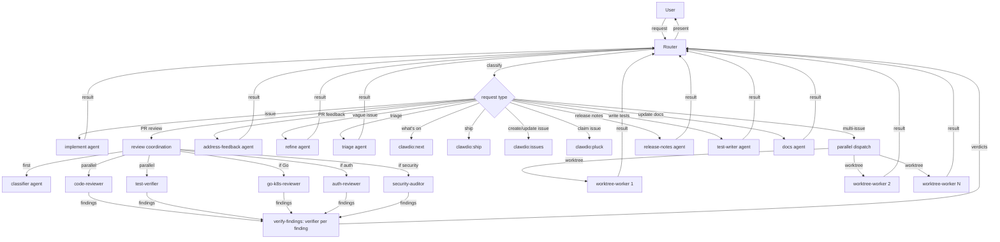
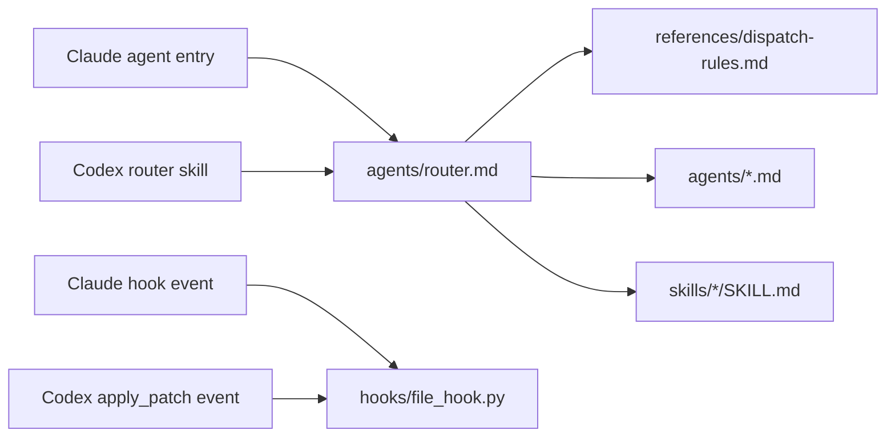
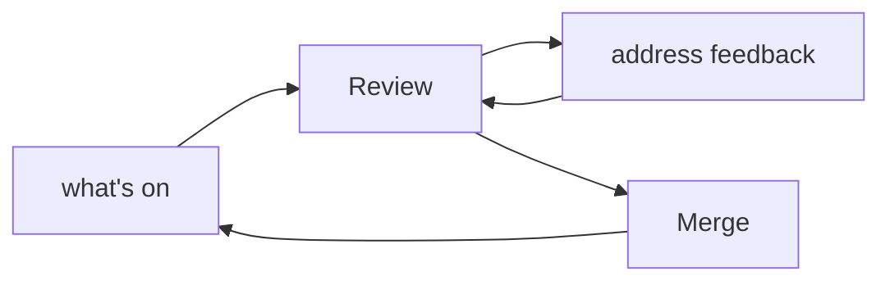

# Architecture

## Origin

This plugin replaces clawdio, a custom Go orchestrator for managing AI agent sessions. After a structured interview (April 2026), the conclusion was: the orchestrator was over-built. The bottleneck was never orchestration infrastructure -- it was agent reliability. The investment should go into portable agents, skills, and hooks that run through Claude Code or Codex.

## Design decisions

### Why a plugin, not an orchestrator

Clawdio provided: work item database, GitHub polling, worktree management, tmux session lifecycle, skill-based prompt construction, workflow chaining (implement > review > merge), and a TUI for monitoring agents.

The clients now provide most of those primitives:

| Capability | Claude Code | Codex |
|-|-|-|
| Shared workflows | Plugin skills | Plugin skills |
| Specialist execution | Plugin subagents | Built-in subagents reading canonical prompt files |
| GitHub operations | `gh` or GitHub MCP | `gh` or GitHub MCP |
| Guardrails | Pre/post tool hooks | Pre/post tool hooks |
| Write isolation | Native worktree isolation | Verified git worktrees, or serial fallback |

What clawdio added on top was multi-agent spawning, monitoring, and workflow chaining. But the user works serially in practice, and the fanout pattern (router agent dispatching specialists) handles workflow chaining in natural language rather than hardcoded YAML transitions.

### Router + specialist pattern

A single canonical router prompt (`agents/router.md`) serves as the entry point for all tasks. It classifies the request, dispatches specialists, collects results, and reports back. Claude Code discovers it as a plugin agent; Codex reaches it through `skills/router/SKILL.md`.

### Portability boundary

The portable core is deliberately larger than either client adapter:

- `agents/*.md` and non-adapter skills are canonical behaviour.
- `references/dispatch-rules.md` translates logical agent dispatch, user decisions, worktree isolation, and skill loading onto the active client.
- `.claude-plugin/plugin.json`, `.codex-plugin/plugin.json`, and `skills/router/SKILL.md` are thin packaging or entry adapters.
- `hooks/file_hook.py` normalises event payloads so hook policy is written once.

Codex plugins do not expose Claude's Markdown agent files as custom agents. The router skill therefore gives a built-in Codex subagent the path to the relevant canonical prompt and requires it to read that file. Copying prompt bodies into `.toml` files would create two sources of truth and is prohibited.

### Multi-pass review

Reviews use the fanout pattern: the router invokes the `review-coordination` skill, which classifies the PR's file paths and determines which specialist reviewers to spawn. A read-only classifier agent buckets each changed file (behaviour, types-mechanical, mixed, tests-docs) before dispatch -- the router never reads the diff -- so specialists weight attention to behaviour and mixed files. The router then dispatches the specialists in parallel and collects results grouped by specialist. Verified findings are posted inline in terse, conversational language; severity and evidence remain in the internal draft, while the review body only acknowledges specific work and states the next step.

Specialist findings are treated as claims, not facts. Before findings are presented or posted, the router invokes the `verify-findings` skill: one verifier agent per Critical/Important finding, in parallel, tasked with refuting it. Confirmed and plausible findings proceed; refuted findings remain visible to the user in the internal draft and are recorded in prior-review context so they do not resurrect on re-review rounds.

The router owns all agent dispatch. This is a cross-client design invariant: specialists return results and never fan out further. The review-coordination and verify-findings skills provide classification, merge, and verification logic; the router executes the fanout using the active client adapter.

### SDLC loop

The review flow feeds into address-feedback, which feeds back into review. The router manages this loop.

### Diff gate

After the implement agent completes, ship verifies the agent actually produced code changes by checking `git rev-list` and `git status`. If both are empty, the workflow stops with `blocked` status rather than proceeding to push an empty branch.

This is inline in the ship skill, not a universal hook. A PostToolUse hook can't distinguish implementation agents from other agent calls (it only sees the tool name, not the task semantics). The archived Go engine had typed skill contracts with a `phase` field to scope this; the hook system has no equivalent.

### Workflow state

Multi-phase skills persist their progress to memory files (`memory/workflow_<skill>_<branch>.md`) after each phase gate. If a session dies mid-flow, the next invocation detects the state file and offers to resume.

This replaces the archived engine's `WorkflowRun` database table and `.clawdio-progress.md` file. The memory system is simpler (plain markdown files with frontmatter) and already survives context compression. State files are cleaned up on workflow completion.

### Client dispatch adapters

All workflows use a logical pattern: router sends one task, specialist executes it, result returns. Review specialists do not need mid-flight communication because the router merges and verifies their findings after they complete.

| Client | Dispatch rule |
|-|-|
| Claude Code | Use `subagent_type: "clawdio:<agent>"` without `name`; track the returned `agentId` |
| Codex | Choose a built-in role (`worker`, `explorer`, or `default`) and require it to read the resolved canonical agent file before acting |

The complete mapping lives in `references/dispatch-rules.md`. Client tool syntax must not leak into individual workflow skills.

### Worktree isolation

Claude Code can provide worktree isolation on dispatch. Where Codex does not expose equivalent isolation, the router creates separate git worktrees, passes each absolute path to its worker, and verifies the worker's repository root before concurrent write-heavy work. If isolation cannot be guaranteed, writers run serially.

This enables parallel multi-issue work: the router dispatches N worktree-worker agents simultaneously, each in its own worktree, each implementing a different issue. They can't conflict because they're in separate worktrees. When they finish, the router collects structured results (PR URLs, branch names, or blocked status) and presents a summary.

The worktree-worker agent is deliberately constrained: it must not dispatch other agents or escape its worktree, and it has a structured output format the router can parse. This makes it a predictable, parallelisable unit of work.

Each worktree-worker writes a `.clawdio-state` file in the worktree root after every phase transition. This file is never git-committed — it's orchestrator-internal. The router checks for these files before dispatching new workers, enabling recovery of workers that died mid-run. The state file records the current phase, issue reference, branch, PR URL, and timestamps.

### Three-tier primitive location

1. **Per-repo**: `AGENTS.md`, `CLAUDE.md`, and repository-specific tools or policy
2. **Clawdio plugin**: portable SDLC prompts, workflows, and guardrails
3. **External capability plugins**: personal or organisational skills resolved by intent, with local fallbacks where possible

### Vertex auth

The author's Claude Code setup uses Google Vertex AI. That is a local authentication choice, not part of the plugin contract and not used by Codex.

### Additional execution surfaces

Interactive use starts in Claude Code or Codex. Scheduling, GitHub Actions, custom UIs, or a Backstage plugin can wrap the same canonical prompt resources later; such adapters should translate dispatch mechanics rather than fork workflow content.

## Success metric

"I open my coding client, say 'what's on?', it shows my priorities, I tell it to go."

## User profile

- Senior software engineer
- Works across 3-5 repos in a typical week
- Mix of feature implementation, PR review, and bug investigation
- Deliberate process: read > refine > plan > code > self-review > PR > team review > feedback > merge
- Uses AI assistance across multiple steps, not just for coding
- Team is actively adopting AI workflows
- For personal repos: full autonomy, autopilot acceptable
- For team repos: agents assist, but human stays in the loop

## Agent catalogue

| Agent | Purpose | Scope |
|-|-|-|
| router | Task intake, classification, delegation, review coordination | Plugin |
| implement | Takes a well-defined issue, writes code, runs tests, commits | Plugin |
| code-reviewer | General code quality review | Plugin |
| security-auditor | Security-focused review (OWASP, injection, secrets) | Plugin |
| go-k8s-reviewer | Go/Kubernetes specialist reviewer | Plugin |
| auth-reviewer | Auth/policy specialist reviewer | Plugin |
| triage | Assesses new issues, labels, prioritises, checks readiness | Plugin |
| refine | Takes vague issues, asks clarifying questions, produces acceptance criteria | Plugin |
| address-feedback | Takes review comments on a PR, fixes them | Plugin |
| release-notes | Generates release notes between tags | Plugin |
| test-writer | Writes tests, finds coverage gaps | Plugin |
| test-verifier | Verifies PR test plans, runs tests, drives browser for UI checks | Plugin |
| verifier | Adversarial verifier for exactly one finding; refutes or confirms with evidence | Plugin |
| docs | Documentation writing and updating | Plugin |
| worktree-worker | Self-contained implement-to-PR in an isolated worktree, for parallel dispatch | Plugin |

The router owns all agent dispatch, including review fanout and worktree-worker dispatch. Specialists do not dispatch other agents, regardless of which client happens to support nesting.

## Skill catalogue

| Skill | Purpose | Args |
|-|-|-|
| router | Codex entry adapter; loads canonical dispatch and router prompts | conversation context |
| next | Scans GitHub for actionable work, prioritised by project board or saved team view when one exists | none |
| ship | Full lifecycle: implement > push > draft PR > review > merge | `<issue>`, `--resume`, `--skip-review`, `--ready` |
| pr-description | PR body template and conventions | none |
| issues | Create, update, link, and manage GitHub issues and PR relationships | `create`, `update`, `close`, `link`, `--repo` |
| pluck | Claim unassigned issues from the repo backlog | none |
| doc-sync | Verify and fix documentation accuracy against actual repo contents | none |
| review-coordination | Coordinates multi-specialist PR review fanout | none |
| verify-findings | Adversarial verification of Critical/Important findings before presenting or posting | none |
| merge-gate | Pre-merge safety checks before any merge | none |
| worktree-recovery | Recovers in-progress worktree workers before dispatching new ones | none |
| parallel-ship | Dispatches multiple worktree-workers in parallel for multi-issue ship | `<issues>` |

Skills for commit conventions, security checklists, and review rubrics come from [agent-skills](https://github.com/addyosmani/agent-skills) on Claude Code or an installed equivalent elsewhere. Canonical agents retain enough baseline procedure to continue when those extensions are absent.

## Hook catalogue

| Hook | Trigger | Purpose |
|-|-|-|
| block-env-writes | PreToolUse (Write/Edit/apply_patch) | Prevent writing to .env and credential files |
| doc-sync-reminder | PostToolUse (Write/Edit/apply_patch) | Remind contributors to update docs and both manifests |
| format-on-save | PostToolUse (Write/Edit/apply_patch) | Auto-format code after edits |
| lint-on-edit | PostToolUse (Write/Edit/apply_patch) | Run a configured linter after edits |

## MCP servers

| Server | Purpose |
|-|-|
| GitHub MCP | Issues, PRs, Actions, releases, code search |
| [Atlassian MCP](https://github.com/sooperset/mcp-atlassian) | Jira issue search, creation, updates |

## Dependencies

| Dependency | Type | Purpose |
|-|-|-|
| [agent-skills](https://github.com/addyosmani/agent-skills) | External capability provider | Declared Claude dependency; other clients resolve an equivalent or use the baseline |
| [dev-team-plugin](https://github.com/kuadrant/dev-team-plugin) | External capability provider | Declared Claude dependency; local compositions cover other clients |
| `gh` CLI | CLI tool | GitHub issue/PR operations (must be authenticated) |
| Python 3.9+ | Runtime | Shared hook payload adapter |
| GitHub MCP server | MCP server | Issue/PR comments, review threads |
| Atlassian MCP server | MCP server | Jira issue search and management |

## References

- [Codex plugins](https://learn.chatgpt.com/docs/build-plugins) -- manifests, skills, hooks, and marketplace packaging
- [Codex subagents](https://learn.chatgpt.com/docs/agent-configuration/subagents) -- built-in roles and custom-agent configuration
- [addyosmani/agent-skills](https://github.com/addyosmani/agent-skills) -- external capability provider
- [kuadrant/dev-team-plugin](https://github.com/kuadrant/dev-team-plugin) -- external design and feature-lifecycle provider
